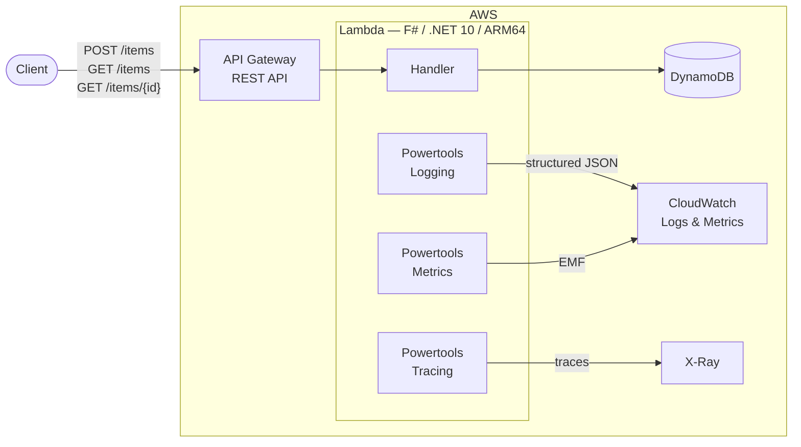

# F# Lambda with Powertools for AWS

F# (.NET 10) Lambda with [Powertools for AWS Lambda (.NET)](https://docs.powertools.aws.dev/lambda/dotnet/) — structured logging, CloudWatch metrics (EMF), and X-Ray tracing. Deployed via CDK.

API Gateway REST API -> Lambda -> DynamoDB.



## F# Compatibility

Powertools for AWS Lambda (.NET) targets C#. Two things break in F#.

### 1. Auto-generated `.g.cs` files

Powertools 3.x ships MSBuild `.targets` in each package (Logging, Metrics, Tracing) that inject C# module initializers into compilation via `BeforeTargets="BeforeCompile"`. The F# compiler rejects `.cs` files:

```
error FS0226: The file extension of 'PowertoolsTracingAutoInitializer.g.cs'
is not recognized. Source files must have extension .fs, .fsi, .fsx, ...
```

**Fix:** Override the targets with no-ops in [`Directory.Build.targets`](src/Lambda/Directory.Build.targets). A regular override in the `.fsproj` gets clobbered because NuGet package targets import after the project file. `Directory.Build.targets` imports last and wins.

```xml
<Project>
  <Target Name="InjectLoggingAutoInitializer" />
  <Target Name="InjectMetricsAutoInitializer" />
  <Target Name="InjectTracingAutoInitializer" />
</Project>
```

### 2. Decorator attributes are no-ops

`[<Logging>]`, `[<Tracing>]`, and `[<Metrics>]` use [AspectInjector](https://github.com/pamidur/aspect-injector) for IL weaving. AspectInjector scans compiled IL for annotated methods and rewrites them to inject cross-cutting behaviour.

C#: `AspectInjector|2.8.1: Found 0 aspects, 6 injections`. F#: 0 injections. AspectInjector doesn't recognise the IL patterns the F# compiler emits. The attributes compile as metadata but nothing acts on them.

**Fix:** Call `Logger`, `Metrics`, and `Tracing` directly. The static APIs work from F# without issue.

The `[<Metrics>]` attribute auto-flushes on handler completion. Without it, call `Metrics.Flush()` explicitly. Use `try ... finally` to guarantee flush even on exceptions:

```fsharp
member _.FunctionHandler(request, _context) =
    try
        try
            // handler logic + Metrics.AddMetric(...)
        with ex ->
            response 500 """{"message":"Internal server error"}"""
    finally
        Metrics.Flush()
```

F# doesn't allow `with` and `finally` in the same `try` — nest them.

Replace AOP decorators with a higher-order function:

```fsharp
let withPowertools (operationName: string) (f: 'a -> Async<'b>) (input: 'a) : Async<'b> =
    async {
        Tracing.AddAnnotation("operation", operationName) |> ignore
        Logger.LogInformation($"Starting {operationName}")
        try
            let! result = f input
            Metrics.AddMetric("SuccessCount", 1.0, MetricUnit.Count)
            return result
        with ex ->
            Logger.LogError($"Error in {operationName}: {ex.Message}")
            Metrics.AddMetric("ErrorCount", 1.0, MetricUnit.Count)
            return raise ex
    }
```

## Project Structure

```
├── src/Lambda/
│   ├── Directory.Build.targets  # Suppresses Powertools .g.cs injection
│   ├── FSharpBedrockPtLambda.fsproj
│   ├── Types.fs                 # Domain types
│   ├── DynamoDb.fs              # DynamoDB access layer
│   ├── Powertools.fs            # Higher-order Powertools wrapper
│   └── Handler.fs               # API Gateway proxy event handler
├── infra/
│   ├── package.json             # CDK as devDependency
│   ├── cdk.json
│   ├── bin/app.ts
│   └── lib/stack.ts             # API GW + Lambda + DynamoDB stack
├── global.json
└── FSharpBedrockPtLambda.slnx
```

F# compilation is order-dependent. Files in the `.fsproj` must be listed in dependency order.

## Prerequisites

- .NET 10 SDK
- Node.js (for CDK)
- AWS credentials configured

## Deploy

```bash
cd infra
npm install
npx cdk bootstrap --profile <your-profile>
npx cdk deploy --profile <your-profile>
```

Bundles the Lambda locally via `dotnet publish`. No Docker required.

## Test

```bash
curl -X POST "$API_URL/items" \
  -H "Content-Type: application/json" \
  -d '{"name":"Test","description":"Hello from F#"}'

curl "$API_URL/items"

curl "$API_URL/items/<id>"
```

## Teardown

```bash
cd infra
npx cdk destroy --profile <your-profile>
```
